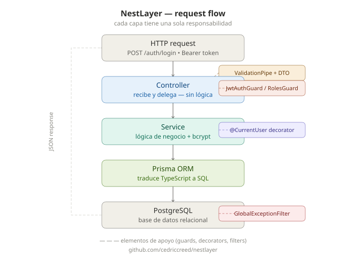

# NestLayer

**A clean, layered NestJS boilerplate — built to be understood, not just cloned.**

**Un boilerplate NestJS limpio y en capas — hecho para entenderse, no solo para clonarse.**

[](https://nestjs.com/)
[](https://www.typescriptlang.org/)
[](https://www.postgresql.org/)
[](https://www.prisma.io/)
[](https://swagger.io/)
[](LICENSE)

---

## What is NestLayer

### 🇬🇧 English

NestLayer is a small, readable **backend starter**. It is a working NestJS API you can run on your laptop and open in the editor to see how a real server is usually organized.

It already includes a database, login with tokens, validation, and docs — so you are not staring at an empty `Hello World` and guessing what comes next.



*How a request travels: HTTP → guards & pipes → controllers → services → Prisma → PostgreSQL.*

### 🇪🇸 Español

NestLayer es un **backend de partida** pequeño y legible. Es una API NestJS que funciona: la corres en tu laptop y la abres en el editor para ver cómo suele organizarse un servidor real.

Ya trae base de datos, login con tokens, validación y documentación — no te quedas mirando un `Hello World` vacío adivinando qué sigue.


*Cómo viaja un request: HTTP → guards y pipes → controllers → services → Prisma → PostgreSQL.*

---

## Who is this for

### 🇬🇧 English

- **First-time NestJS learners** — you do not need to know Nest already; folders and comments explain the “why.”
- **Juniors** who want a **real backend shape**: modules, services, guards, Prisma — not a single giant file.
- **Anyone** who wants a **solid, documented** starting point to fork and grow (auth is already there).

### 🇪🇸 Español

- **Quienes aprenden NestJS por primera vez** — no hace falta saber Nest de antemano; las carpetas y los comentarios explican el “porqué”.
- **Juniors** que quieren ver una **estructura de backend real**: módulos, services, guards, Prisma — no un archivo gigante.
- **Cualquiera** que quiera un punto de partida **sólido y documentado** para hacer fork y crecer (el auth ya está).

---

## Tech Stack

### 🇬🇧 English

| Technology | What it does here |
| --- | --- |
| **NestJS** | Server framework (routes, modules, dependency injection). |
| **TypeScript** | Typed JavaScript — mistakes show up while you type. |
| **PostgreSQL** | Database that stores users. |
| **Prisma 7** | Talks to Postgres from TypeScript (with a driver adapter). |
| **JWT** | Signed tokens for login (access + refresh). |
| **bcrypt** | One-way hash so we never save plain passwords. |
| **Swagger** | Interactive API docs at `/docs`. |
| **Docker Compose** | Optional PostgreSQL in a container for local dev. |
| **class-validator** | Checks request bodies (email, password length, …). |
| **Joi** | Checks `.env` when the app starts. |

### 🇪🇸 Español

| Tecnología | Qué hace aquí |
| --- | --- |
| **NestJS** | Framework del servidor (rutas, módulos, inyección de dependencias). |
| **TypeScript** | JavaScript con tipos — los errores aparecen al escribir. |
| **PostgreSQL** | Base de datos que guarda usuarios. |
| **Prisma 7** | Habla con Postgres desde TypeScript (con driver adapter). |
| **JWT** | Tokens firmados para el login (access + refresh). |
| **bcrypt** | Hash de un solo sentido: nunca guardamos passwords en claro. |
| **Swagger** | Docs interactivas de la API en `/docs`. |
| **Docker Compose** | PostgreSQL opcional en un contenedor para desarrollo. |
| **class-validator** | Revisa los bodies (email, largo de password, …). |
| **Joi** | Revisa el `.env` al arrancar la app. |

---

## Features

### 🇬🇧 English

- JWT authentication (**access + refresh** tokens)
- Role-based authorization (`USER` / `ADMIN`)
- Password hashing with **bcrypt**
- **Global** error handling (same JSON shape every time)
- Environment variable validation with **Joi**
- **Swagger** documentation at `/docs`
- **Docker Compose** for local PostgreSQL
- **Educational comments** throughout the code
- Bilingual **[ARCHITECTURE.md](ARCHITECTURE.md)** (English + Spanish)

### 🇪🇸 Español

- Autenticación JWT (tokens de **access + refresh**)
- Autorización por roles (`USER` / `ADMIN`)
- Hash de passwords con **bcrypt**
- Manejo de errores **global** (el mismo JSON siempre)
- Validación de variables de entorno con **Joi**
- Documentación **Swagger** en `/docs`
- **Docker Compose** para PostgreSQL local
- **Comentarios educativos** en el código
- **[ARCHITECTURE.md](ARCHITECTURE.md)** bilingüe (inglés + español)

---

## Quick Start

### 🇬🇧 English

Need more detail? See [Getting Started in ARCHITECTURE.md](ARCHITECTURE.md#3-getting-started).

```bash
git clone https://github.com/cedriccreed/nestlayer.git
cd nestlayer
npm install
cp .env.example .env
```

Edit `.env`: set `DATABASE_URL` (and `POSTGRES_*` if you use Docker). Create the `nestlayer` database, **or** run `docker-compose up -d`.

```bash
npx prisma migrate dev
npm run start:dev
```

Open [http://localhost:3000/docs](http://localhost:3000/docs).

### 🇪🇸 Español

¿Quieres más detalle? Mira [Getting Started en ARCHITECTURE.md](ARCHITECTURE.md#3-getting-started).

```bash
git clone https://github.com/cedriccreed/nestlayer.git
cd nestlayer
npm install
cp .env.example .env
```

Edita `.env`: pon `DATABASE_URL` (y `POSTGRES_*` si usas Docker). Crea la base `nestlayer`, **o** corre `docker-compose up -d`.

```bash
npx prisma migrate dev
npm run start:dev
```

Abre [http://localhost:3000/docs](http://localhost:3000/docs).

---

## Project Structure

### 🇬🇧 English

```text
nestlayer/
├── prisma/                 Table blueprints + SQL migrations
├── prisma.config.ts        Prisma 7 CLI (DATABASE_URL)
├── docker-compose.yml      Optional local Postgres box
├── src/
│   ├── main.ts             Starts the server, Swagger, global pipes
│   ├── app.module.ts       Wires Config, Prisma, Users, Auth
│   ├── auth/               Register, login, logout, refresh
│   ├── users/              Find user by email or id
│   ├── prisma/             PrismaClient + PostgreSQL adapter
│   └── common/             Decorators, RolesGuard, error filter
├── test/                   End-to-end tests
├── ARCHITECTURE.md         Long, beginner-friendly tour
└── README.md               This file
```

### 🇪🇸 Español

```text
nestlayer/
├── prisma/                 Planos de tablas + migraciones SQL
├── prisma.config.ts        CLI de Prisma 7 (DATABASE_URL)
├── docker-compose.yml      Caja opcional de Postgres local
├── src/
│   ├── main.ts             Arranca el servidor, Swagger, pipes globales
│   ├── app.module.ts       Conecta Config, Prisma, Users, Auth
│   ├── auth/               Register, login, logout, refresh
│   ├── users/              Buscar usuario por email o id
│   ├── prisma/             PrismaClient + adapter PostgreSQL
│   └── common/             Decorators, RolesGuard, filtro de errores
├── test/                   Tests end-to-end
├── ARCHITECTURE.md         Recorrido largo, para principiantes
└── README.md               Este archivo
```

---

## API Endpoints

### 🇬🇧 English

| Method | Path | Protected | Description |
| --- | --- | --- | --- |
| `GET` | `/` | No | Simple health/hello response. |
| `POST` | `/auth/register` | No | Create a user (password is hashed). |
| `POST` | `/auth/login` | No | Returns access + refresh JWTs. |
| `POST` | `/auth/logout` | Yes (access JWT) | Clears the stored refresh hash. |
| `POST` | `/auth/refresh` | Yes (refresh JWT) | Issues a new token pair. |

Interactive try-out: [http://localhost:3000/docs](http://localhost:3000/docs) after `npm run start:dev`.

### 🇪🇸 Español

| Método | Ruta | Protegido | Descripción |
| --- | --- | --- | --- |
| `GET` | `/` | No | Respuesta simple de salud/hello. |
| `POST` | `/auth/register` | No | Crea un usuario (la password se hashea). |
| `POST` | `/auth/login` | No | Devuelve JWTs de access + refresh. |
| `POST` | `/auth/logout` | Sí (JWT access) | Borra el hash de refresh guardado. |
| `POST` | `/auth/refresh` | Sí (JWT refresh) | Emite un par de tokens nuevo. |

Prueba interactiva: [http://localhost:3000/docs](http://localhost:3000/docs) después de `npm run start:dev`.

---

## Learn More

### 🇬🇧 English

For analogies, layer-by-layer explanations, JWT stories, and design decisions, read **[ARCHITECTURE.md](ARCHITECTURE.md)**. This README is the map; that file is the guided tour.

### 🇪🇸 Español

Para analogías, capas paso a paso, la historia del JWT y las decisiones de diseño, lee **[ARCHITECTURE.md](ARCHITECTURE.md)**. Este README es el mapa; ese archivo es la visita guiada.

---

## Author

### 🇬🇧 English

Created by **cedriccreed**, a Full Stack developer from Chile.

GitHub: [https://github.com/cedriccreed](https://github.com/cedriccreed)

### 🇪🇸 Español

Creado por **cedriccreed**, desarrollador Full Stack de Chile.

GitHub: [https://github.com/cedriccreed](https://github.com/cedriccreed)

---

## License

### 🇬🇧 English

This project is licensed under the **MIT** License. You may use, copy, modify, and distribute it with attribution. See the license file in the repository if one is present.

### 🇪🇸 Español

Este proyecto usa la licencia **MIT**. Puedes usarlo, copiarlo, modificarlo y distribuirlo con atribución. Revisa el archivo de licencia del repositorio si existe.
